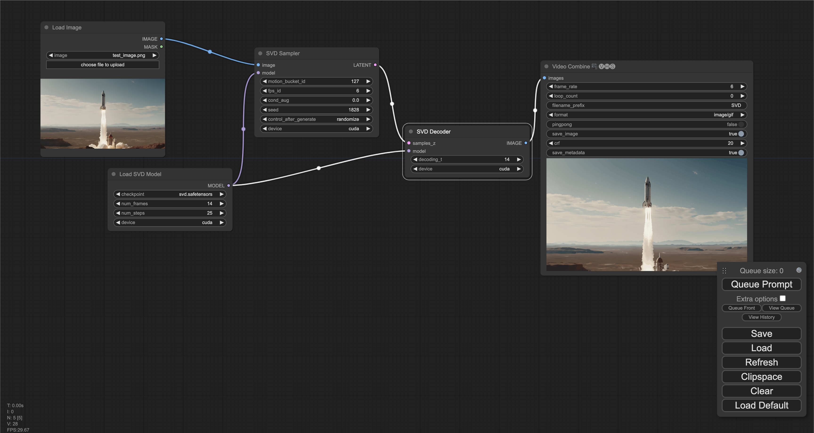
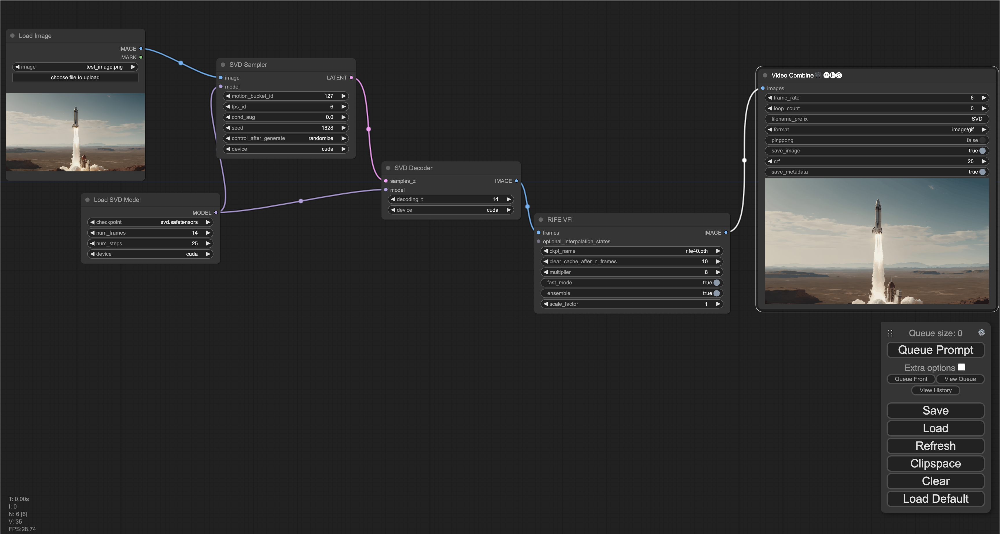

# ComfyUI Stable Video Diffusion
Easily use Stable Video Diffusion inside ComfyUI!

[](https://discord.gg/MfVCahkc2y)


<!-- table of contents -->
- [Installation](#1-installation)
- [Node types](#node-types)
- [Example workflows](#example-workflows)
    - [Image to video](#image-to-video)
    - [Image to video generation (high FPS w/ frame interpolation)](#image-to-video-generation-high-fps-w-frame-interpolation)

Need help? <a href="https://discord.gg/hwwbNRAq6E">Join our Discord!</a>

## 1. Installation

### Option 1: Install via ComfyUI Manager
Open ComfyUI Manager and install the `ComfyUI-Stable-Video-Diffusion` custom node.

### Option 2: Install manually
```
cd ComfyUI/custom_nodes/
git clone https://github.com/thecooltechguy/ComfyUI-Stable-Video-Diffusion
cd ComfyUI-Stable-Video-Diffusion/
python install.py
```

### 2. Download models into `ComfyUI/models/svd/`
 - svd.safetensors - [Download](https://huggingface.co/stabilityai/stable-video-diffusion-img2vid/resolve/main/svd.safetensors?download=true)
 - svd_image_decoder.safetensors - [Download](https://huggingface.co/stabilityai/stable-video-diffusion-img2vid/resolve/main/svd_image_decoder.safetensors?download=true)
 - svd_xt.safetensors - [Download](https://huggingface.co/stabilityai/stable-video-diffusion-img2vid-xt/resolve/main/svd_xt.safetensors?download=true)
 - svd_xt_image_decoder.safetensors - [Download](https://huggingface.co/stabilityai/stable-video-diffusion-img2vid-xt/resolve/main/svd_xt_image_decoder.safetensors?download=true)

## Node types
- **SVDModelLoader**
    - Loads the Stable Video Diffusion model
- **SVDSampler**
    - Runs the sampling process for an input image, using the model, and outputs a latent
- **SVDDecoder**
    - Decodes the sampled latent into a series of image frames
- **SVDSimpleImg2Vid**
    - Combines the above 3 nodes above into a single node

## Example workflows

### Image to video
[https://comfyworkflows.com/workflows/5a4cd9fd-9685-4985-adb8-7be84e8636ad](https://comfyworkflows.com/workflows/5a4cd9fd-9685-4985-adb8-7be84e8636ad)




### Image to video generation (high FPS w/ frame interpolation)
[https://comfyworkflows.com/workflows/bf3b455d-ba13-4063-9ab7-ff1de0c9fa75](https://comfyworkflows.com/workflows/bf3b455d-ba13-4063-9ab7-ff1de0c9fa75)


